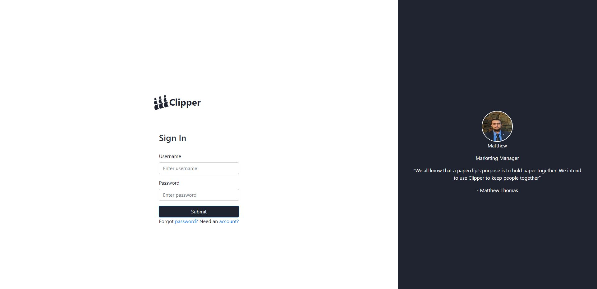
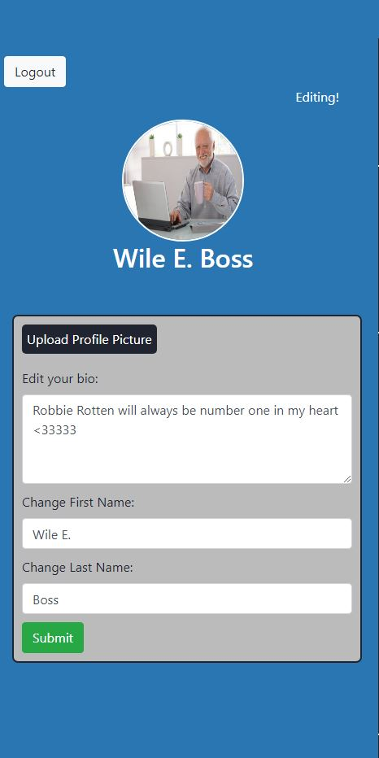

# Clipper

In Revature's Social Network everyone is friends with everyone else. Users can register, login to the application, and start sharing multimedia with everyone. Registered users are allowed to modify their personal information and upload their profile pictures. The application provides a search feature that allows users to search out friends and look at their profiles. Users are provided with a "feed", in which they can see what everyone is posting and like posts. Users can access and use the application via an interactive client-side single paged application that stores and retrieves multimedia using AWS S3 and consumes a RESTful web service that provides business logic and access to a database.

### [Link to Back-end](https://github.com/ricksnp/Clipper)

## Technologies Used

* PostgreSQL
* Agile-Scrum
* HTML
* SCSS
* JavaScript
* Typescript
* React
* Redux
* Agile-Scrum
* Enzyme/Jest
* AWS S3
* AWS EC2

## Features
* As a user
  * I can login.
  * I can register.
  * I can write a post.
  * I can like a post.
  * I can search other users and view their profile.
  * I can edit my profile. change my name, password and profile picture.
  * I can ask for a password reset and the application will send me an email on how to reset my password.

## Getting Started
* Download and install [git](https://git-scm.com/downloads).
* Install node from [node.js](https://nodejs.org/).
* Go to your terminal and git clone this repository using: git clone https://github.com/MatthewLThomas/ClipperFront.git
* The src/_util/axiosConfig.ts file is where the base endpoints for the application are stored. Change the baseURL to localhost:{theport}/Clipper if you are hosting this application locally.  Otherwise, change the current baseURL to point to whereever you decide to host the back-end. 
* Cd into React/redux in your terminal
* Run npm start
* In your browser, go to localhost:3000

## Usage
1. Login:

2. Feed:

3. Post Example:

4. Profile:

## Contributors
* Matthew Thomas
* Nathan Ricks
* Dawit Wondim
* Nicolas Hernandez
* Daniel Constantinescu
